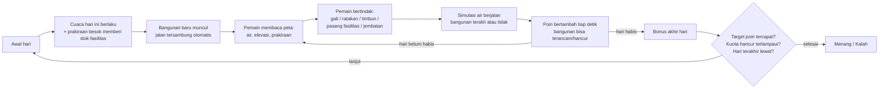
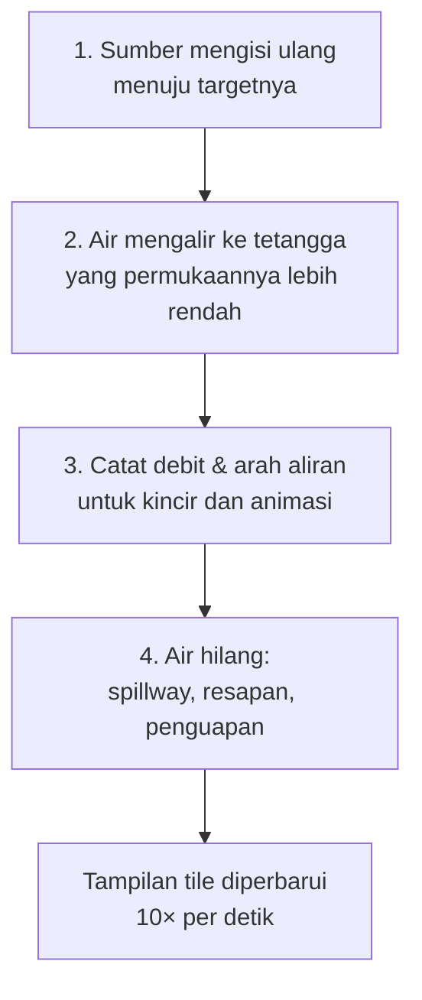

# WATERWAYS — Mekanik Game

Dokumen ini menjelaskan **alur permainan (core loop)** dan **sistem air** WATERWAYS sesuai kode yang ada sekarang, supaya seluruh tim (programmer & artist) punya pemahaman yang sama.

- Semua angka di bawah adalah **nilai default**. Angka-angka ini bisa diubah di **Inspector** tanpa menyentuh kode. Kolom "Atur di" menunjukkan node dan properti yang dimaksud, dan semuanya ada di `world.tscn` kecuali disebut lain.
- Kalau kode berubah, dokumen ini juga perlu diperbarui.

---

## 1. Ringkasan

WATERWAYS adalah game puzzle-strategi isometrik. Pemain berperan sebagai perencana saluran air. Kota tumbuh sendiri: bangunan baru muncul setiap hari. Tugas pemain adalah **mengalirkan air** dari sumber alam ke bangunan dengan menggali kanal, mengatur ketinggian tanah, dan memasang fasilitas, sambil menghadapi **kemarau** dan **hujan lebat**.

- **Menang:** total poin mencapai target (default **600**) sebelum hari terakhir berakhir.
- **Kalah:** bangunan yang hancur **melebihi kuota** (default **5**), atau waktu habis sebelum target tercapai.

---

## 2. Core loop



### 2.1 Siklus hari

| Aturan | Default | Atur di |
|---|---|---|
| Panjang satu hari | 30 detik | Node2D → `day_length` |
| Jumlah hari | 8 | Node2D → `target_days` |
| Kecepatan | Jeda / 1× / 2× (tombol kanan atas, Spasi = jeda) | — |

Yang terjadi di **awal setiap hari**, berurutan:
1. Bonus akhir hari sebelumnya dihitung (lihat §6).
2. Jatah sekop direset (§4.1) dan stok jembatan bertambah.
3. Cuaca hari ini berlaku (§5.5). **Prakiraan cuaca besok** menentukan tambahan stok fasilitas (§4.2).
4. Bangunan baru muncul (§3).

### 2.2 Area main
- Peta besar berukuran 250×250 petak dan **dibuat di editor Godot** (TileMapLayer `World`), bukan di-generate saat runtime.
- Setiap permainan memilih **area inti 25×25** secara acak yang pasti berisi sumber air. Kamera diatur supaya area itu pas di layar.
- **Semua petak yang terlihat di layar** (termasuk yang tertutup UI) ikut disimulasikan dan bisa dipakai. Bangunan baru hanya muncul di area inti.
- Pengacakan memakai **seed**: Node2D → `map_seed` (0 = acak). Seed yang terpakai selalu dicatat di log playtest, jadi peta yang sama bisa diulang.

---

## 3. Kota: bangunan & jalan

### 3.1 Kemunculan bangunan
| Aturan | Default | Atur di |
|---|---|---|
| Bangunan di hari 1 | 2 | Buildings → `buildings_first_day` |
| Tambahan per hari | +0,5 (= +1 tiap 2 hari) | Buildings → `extra_buildings_per_day` |
| Peluang jadi Ladang (sisanya Rumah) | 35% | Buildings → `farm_chance` |
| Jarak minimal antarbangunan | 3 petak | Buildings → `min_building_spacing` |
| Jarak ke air terdekat | min 3, maks 6 (awal) → 12 (akhir) petak | Buildings → `min_water_distance`, `max_water_distance_start/_end` |

Artinya, bangunan sengaja muncul **agak jauh dari air**. Pemain *harus* menggali kanal, dan semakin lama permainan berjalan, kanalnya harus semakin panjang.

### 3.2 Kebutuhan air bangunan
Setiap bangunan punya **cadangan air** yang terlihat sebagai cincin di atasnya.

| | Rumah | Ladang |
|---|---|---|
| Cadangan air maksimal | 40 | 28 |

Atur di `building.gd` → `TYPE_DATA`.

- **Teraliri** (lihat aturan di bawah): cadangan terisi **4× lebih cepat** daripada berkurangnya.
- **Tidak teraliri**: cadangan berkurang 1 per detik.
- Cadangan di bawah 40%: status **Terancam** (cincin oranye/merah, tanda seru berkedip).
- Cadangan habis: **Hancur** (jadi reruntuhan).
- **Banjir**: kalau petak bangunan tergenang ≥ 6 detik, bangunan juga hancur (Building → `flood_limit`).

**Aturan "teraliri":** bangunan teraliri kalau salah satu dari **8 petak di sekelilingnya** adalah kanal atau sumber air yang **sedang berair** dan **elevasinya sama atau lebih tinggi** dari bangunan (air tidak bisa naik). Saat **hujan lebat**, semua bangunan dianggap teraliri.

### 3.3 Jalan
- Setiap bangunan baru otomatis disambungkan ke bangunan lain dengan jalan (jalur terpendek, mengutamakan jalan yang sudah ada).
- **Jalan memotong kanal**: tanah di jalan tidak bisa digali. Untuk melewatkan air menyeberangi jalan, pasang **Jembatan** (§4.2).

---

## 4. Aksi pemain

Toolbar di bawah layar berisi 8 alat (tombol 1–8). Angka di pojok kartu menunjukkan stok yang tersisa.

### 4.1 Alat sekop: Gali, Ratakan, Timbun
Ketiganya berbagi **jatah sekop harian**.

| Aturan | Default | Atur di |
|---|---|---|
| Jatah sekop per hari | 15 aksi | Node2D → `shovel_per_day` |
| Sisa jatah | **tidak** terbawa ke besok | — |

| Alat | Klik kiri | Klik kanan | Biaya |
|---|---|---|---|
| **Gali** (1) | Tanah → **kanal** (dasar turun 0,5) | — | 1 sekop |
| **Ratakan** (2) | Turunkan elevasi 1 tingkat | Naikkan 1 tingkat | 1 sekop |
| **Timbun** (3) | Tutup kanal galian → tanah lagi | — | 1 sekop |
| Timbun di fasilitas/jembatan | Bongkar, **stok dikembalikan** | — | gratis |

**Drag (seret) seperti Mini Motorways:** tekan di satu petak, seret, lalu lepas.
- Jalurnya selalu **rapi mengikuti grid**: lurus di satu sumbu isometrik, lalu belok sekali (bentuk L) mengikuti arah seret pertama.
- Selama menyeret ada pratinjau: **hijau** = dikerjakan, **putih** = dilewati karena sudah sesuai, **merah** = tidak bisa atau sekop tidak cukup.
- Tooltip menampilkan jumlah petak dan sekop yang akan terpakai.
- Aksi baru dijalankan saat tombol mouse **dilepas**. Esc atau menekan tombol mouse lain membatalkan drag.
- Untuk Ratakan, seret dengan klik kiri untuk menurunkan dan klik kanan untuk menaikkan. Setiap petak di jalur berubah ±1 tingkat.
- Panjang jalur maksimal 40 petak (Node2D → `max_drag_length`).

Elevasi punya 4 tingkat (0–3): Garis pantai, Dataran rendah, Dataran menengah, Dataran tinggi. Air hanya mengalir ke permukaan yang lebih rendah, jadi Ratakan dipakai untuk "membuat lereng" agar air bisa sampai ke bangunan.

### 4.2 Fasilitas & jembatan
| Alat | Fungsi | Syarat pasang | Stok awal | Tambahan stok |
|---|---|---|---|---|
| **Jembatan** (4) | Mengubah petak jalan jadi kanal yang bisa dialiri air (jalan tetap tersambung) | Di petak jalan | 2 | +1 tiap hari baru |
| **Mesin Bor** (5) | Sumber air tanah permanen, **tidak terpengaruh kemarau** | Di tanah | 1 | +1 kalau besok **Kemarau** |
| **Bendungan** (6) | Petak kedap air, menahan/membelokkan aliran | Di tanah atau melintang di kanal galian | 0 | +3 kalau besok **Hujan** |
| **Spillway** (7) | Saluran pembuang. Badan air yang punya spillway **tidak meluap** saat hujan | Di tanah, **bersebelahan** dengan sumber air | 0 | +1 kalau besok **Hujan** |
| **Kincir Air** (8) | Menghasilkan poin dari **air yang mengalir** (§6) | Di kanal atau sungai/danau | 2 | +1 kalau besok **Cerah** |

Atur stok di Facilities → `start_stock` dan `stock_per_forecast` (urutan: Bor, Bendungan, Spillway, Kincir). Untuk jembatan, atur di Roads → `bridges_start`, `bridges_per_day`.

**Inti strateginya:** stok fasilitas diberikan **berdasarkan prakiraan besok**. Pemain mendapat alat yang tepat sehari sebelum cuacanya datang, dan harus memasangnya tepat waktu.

### 4.3 Info untuk pemain
- **Kursor petak** berwarna hijau (bisa), merah (tidak bisa), atau putih (hanya info).
- **Tooltip** menampilkan jenis petak, elevasi, kedalaman air, status bangunan, putaran kincir, dan **pratinjau aksi** alat yang dipilih beserta alasannya kalau tidak bisa.
- **Tombol Lapisan** (ikon di kanan toolbar) berganti antara: Mati → **Ketinggian** (warna per elevasi) → **Kedalaman air**.

### 4.4 Menu in-game
Menu dibuka lewat tombol **roda gigi** di kanan atas atau tombol **Esc**. Selama menu terbuka, game dijeda.

Isi menu: **Lanjutkan**, **Main Ulang**, **Pengaturan**, **Menu Utama**.

Pengaturan berisi:
- volume utama, musik, dan efek suara
- layar penuh
- tooltip info petak

Pengaturan disimpan otomatis di `user://settings.cfg`. Bus audio `Music` dan `SFX` ada di `default_bus_layout.tres`, jadi pemutar musik dan efek suara nanti cukup diarahkan ke bus yang sesuai.

---

## 5. Sistem air

Sistem air adalah **simulasi berbasis kedalaman** yang terinspirasi Timberborn. Kekeringan, banjir, dan arus **tidak di-script**. Semuanya muncul sendiri dari aturan aliran yang sederhana. Kodenya ada di `water_sim.gd`, cuacanya di `weather_manager.gd`.

### 5.1 Konsep dasar

```
Satuan tinggi: 1.0 = satu tingkat elevasi

dasar(petak)     = elevasi            (daratan)
                 = elevasi − 0.5      (kanal galian, dasar sungai/danau, sumur bor)
permukaan(petak) = dasar + kedalaman air
tepi(kanal)      = elevasi            (bibir kanal: air baru tumpah ke darat kalau melewati ini)

berair  = kedalaman ≥ 0.06
banjir  = petak daratan dengan kedalaman ≥ 0.1
```

Jadi kanal adalah "parit" sedalam 0,5. Air mengisi parit itu dulu, dan baru **meluap** ke daratan sekitarnya kalau permukaannya naik melewati bibir kanal.

### 5.2 Satu langkah simulasi (20× per detik)



1. **Sumber mengisi ulang.** Setiap petak sumber air alami bergerak menuju **target**-nya (normal 0,5, diatur cuaca). Sumur bor selalu menuju 0,5.
2. **Aliran.** Setiap petak berair mengalirkan airnya ke 4 tetangga sisi yang permukaannya lebih rendah. Besar aliran = selisih permukaan × 0,2. Kanal tidak menumpahkan air ke daratan kecuali permukaannya sudah melewati tepi. Petak bendungan dilewati (kedap air). Semua perpindahan dihitung dulu, baru diterapkan bersamaan.
3. **Debit & arah.** Air yang keluar dari setiap petak dirata-rata. Hasilnya dipakai untuk putaran kincir (§6) dan arah animasi arus (§5.6).
4. **Air hilang:**
   - Spillway membuang 1,0 per detik.
   - Air di **daratan** meresap 0,08 per detik, yang membatasi luas banjir.
   - **Kanal galian** menguap 0,02 per detik. Kanal yang terputus dari sumber akan mengering pelan-pelan.

| Angka | Default | Atur di |
|---|---|---|
| Langkah per detik | 20 | Water → `tick_rate` |
| Kecepatan aliran | 0,2 | Water → `flow_k` (maks 0,25) |
| Dalam kanal | 0,5 | Water → `channel_depth` |
| Kecepatan sumber mengisi | 1,5 /detik | Water → `source_rate` |
| Batas "berair" | 0,06 | Water → `wet_threshold` |
| Batas "banjir" | 0,1 | Water → `flood_threshold` |
| Penguapan kanal | 0,02 /detik | Water → `canal_evaporation` |
| Resapan daratan | 0,08 /detik | Water → `land_absorb` |
| Laju spillway | 1,0 /detik | Water → `spillway_drain` |

### 5.3 Badan air
Saat permainan mulai, petak-petak sumber air yang saling bersebelahan dikelompokkan menjadi **badan air**: satu sungai atau danau dihitung sebagai satu kesatuan. Cuaca mengatur target setiap badan air. Ukurannya (jumlah petak) menentukan apakah badan air itu termasuk "kecil" saat kemarau.

### 5.4 Dampak ke tampilan daratan
Setiap 1 detik, daratan dikelompokkan ulang menurut jaraknya ke air yang sedang berair:
- ≤ 2 petak dari air: **tanah hijau** (baris 1–2 `terrain_tiles.png`)
- Bangunan dekat air dan sekelilingnya: **pelataran** (baris 3)
- Selain itu: **tanah kering** (baris 0)

Artinya, kemarau secara visual membuat peta jadi cokelat, dan menggali kanal membuat sekitarnya hijau.

### 5.5 Cuaca

Cuaca **tidak mengubah petak secara langsung**. Cuaca hanya mengubah **target sumber**, lalu kekeringan dan banjir muncul sendiri dari simulasi.

**Jadwal default** (Weather → `schedule`):

| Hari | 1 | 2 | 3 | 4 | 5 | 6 | 7 | 8 |
|---|---|---|---|---|---|---|---|---|
| Cuaca | Cerah | Cerah | **Kemarau 1** | Cerah | **Hujan** | **Kemarau 2** | **Hujan** | **Kemarau 3** |

Bar bawah menampilkan prakiraan 3 hari. Tooltip-nya menyebut tingkat kemarau.

**Cerah:** target sumber normal (0,5).

**Kemarau:**
- Sumber menyusut **bertahap** selama 20 detik pertama hari itu, tidak langsung kering.
- **Makin parah setiap kemarau berikutnya:**

  | Kemarau ke- | Sumber besar turun | Sumber kecil (< 15 petak) turun |
  |---|---|---|
  | 1 | 30% | 45% |
  | 2 | 50% | 75% |
  | 3 | 70% | 100% (kering) |

- Rumusnya: `target = 0.5 × (1 − keparahan × kemajuan_hari)`, dengan `keparahan = min(maks, awal + langkah × (n − 1))`, dikali 1,5 untuk badan air kecil.
- Sumur bor tidak terpengaruh.
- Atur di Weather, grup **Kemarau**: `drought_severity_start` (0,3), `drought_severity_step` (0,2), `drought_severity_max` (0,8), `drought_ramp_time` (20), `drought_small_body` (15), `drought_small_mult` (1,5).

**Hujan lebat:**
- Target sumber naik **+0,35** (menjadi 0,85, di atas bibir kanal), sehingga sumber **meluap** ke daratan yang lebih rendah. Inilah banjir.
- Badan air yang punya **Spillway** tidak dinaikkan.
- Semua bangunan dianggap teraliri (tidak ada yang kering), tapi bangunan bisa **tenggelam** kalau tergenang ≥ 6 detik.
- Atur di Weather → `rain_surge`.

### 5.6 Tampilan air (animasi arus ala Terra Nil)
Setiap petak berair memilih tile animasi dari `assets/water/water_flow.png` berdasarkan simulasi:

| Kondisi | Tile |
|---|---|
| Aliran bersih < 0,012 | **Tenang** (danau/genangan) |
| Aliran bersih 0,012 – 0,06 | **Arus pelan** searah aliran (4 arah) |
| Aliran bersih ≥ 0,06 | **Arus deras** searah aliran (4 arah) |
| Kedalaman < 0,18 (bukan sumber alami) | **Dangkal / ujung air** berbuih, terlihat saat kanal baru terisi |

Sisi air yang berbatasan dengan daratan diberi **buih tepi** (layer `World/WaterEdge`, `water_edge.png`).

Ambang ini diatur di Water, grup "Tampilan arus": `still_flow`, `fast_flow`, `shallow_depth`.

### 5.7 Pseudocode singkat

```
// ===== Awal permainan =====
kelompokkan petak AIR yang bersebelahan jadi "badan air" (flood fill)
semua petak badan air: kedalaman = 0.5, target = 0.5

// ===== Awal hari =====
cuaca = jadwal[hari]
stok fasilitas += sesuai prakiraan BESOK
hitung_target_sumber()

// ===== Tiap langkah (20x per detik) =====
JIKA kemarau: hitung_target_sumber()          // target turun bertahap

// 1. Sumber mengisi ulang menuju target
UNTUK tiap petak badan air c: kedalaman[c] += (target[badan(c)] - kedalaman[c]) * 1.5 * dt
UNTUK tiap sumur bor c:       kedalaman[c] += (0.5 - kedalaman[c]) * 1.5 * dt

// 2. Aliran: dihitung dulu, diterapkan bersamaan
UNTUK tiap petak c yang berair dan bukan bendungan:
    s = dasar(c) + kedalaman[c]
    UNTUK tiap tetangga sisi n (bukan bendungan):
        level = dasar(n) + kedalaman[n]
        JIKA c kanal DAN n daratan: level = max(level, elevasi(c))   // bibir kanal
        JIKA s > level: rencana_aliran(c -> n) = (s - level) * 0.2
    skala = min(1, kedalaman[c] / total_rencana)                    // tak boleh lebih dari yang ada
    pindahkan rencana_aliran * skala; catat debit & arah keluar dari c
terapkan semua perpindahan

// 3. Air hilang
UNTUK tiap petak berair c:
    JIKA spillway:            kedalaman[c] -= 1.0  * dt
    JIKA daratan:             kedalaman[c] -= 0.08 * dt   // resapan banjir
    JIKA kanal galian:        kedalaman[c] -= 0.02 * dt   // penguapan

// ===== Target sumber per badan air =====
hitung_target_sumber():
    UNTUK tiap badan air b:
        CERAH:   target = 0.5
        HUJAN:   target = 0.5 jika b punya spillway, selain itu 0.5 + 0.35   // meluap
        KEMARAU: sev = min(0.8, 0.3 + 0.2 * (kemarau_ke - 1))
                 JIKA ukuran(b) < 15: sev = min(1, sev * 1.5)
                 target = 0.5 * (1 - sev * min(1, detik_sejak_awal_hari / 20))

// ===== Dipakai sistem lain =====
berair(c)    = kedalaman[c] >= 0.06
banjir(c)    = c daratan DAN kedalaman[c] >= 0.1
teraliri(b)  = ada tetangga 8 arah n: n kanal/sumber, berair(n), elevasi(n) >= elevasi(b)
               ATAU cuaca HUJAN
putaran_kincir(c) = clamp(debit_rata2(c) / 0.1, 0, 1)
tile_air(c)  = DANGKAL jika kedalaman < 0.18 (bukan sumber alami)
               TENANG  jika aliran_bersih < 0.012
               ARUS PELAN/DERAS ke arah dominan aliran (deras jika >= 0.06)
```

---

## 6. Poin, menang & kalah

| Sumber poin | Besar | Atur di |
|---|---|---|
| Bangunan teraliri | 0,5 poin/detik per bangunan | Score → `supplied_per_second` |
| Kincir air | hingga 1 poin/detik per kincir (× putaran 0–100%) | Facilities → `kincir_points_per_second` |
| Bonus akhir hari | 10 × bangunan yang masih berdiri | Score → `day_bonus_per_building` |
| Jembatan | 3 × jembatan terpasang, tiap akhir hari | Score → `bridge_bonus_per_day` |

**Kincir air:** putaran = debit air yang keluar dari petak kincir ÷ 0,1 (Facilities → `kincir_full_flux`), dibatasi 0–100%. Air hanya mengalir kalau ada yang "menyedot" di hilirnya: penguapan kanal panjang, spillway, resapan banjir, atau air baru yang sedang mengisi kanal. Jadi kincir di **hulu kanal yang panjang** berputar lebih kencang. Kincir di danau yang tenang diam saja.

| Kondisi | Default | Atur di |
|---|---|---|
| **Menang** | Total poin ≥ 600 | Score → `target_points` |
| **Kalah** (kuota) | Bangunan hancur > 5 | Node2D → `damage_quota` |
| **Kalah** (waktu) | Hari ke-8 selesai dan poin < 600 | Node2D → `target_days` |

Klik bar poin di kiri atas untuk melihat rincian poin per sumber.

---

## 7. Alat balancing

### 7.1 Log playtest otomatis
Setiap kali game dimainkan, otomatis dibuat:
- `playtest_logs/sesi_<tanggal_jam>_<penguji>.csv`, berisi:
  - satu baris per akhir hari (poin per sumber, bangunan hidup/terancam/hancur, sekop, stok, fasilitas, persentase kanal berair)
  - satu baris setiap bangunan hancur, beserta penyebabnya
  - satu baris hasil akhir
- `playtest_logs/ringkasan_<penguji>.csv`, berisi satu baris per sesi.

Nama penguji diambil dari nama user Windows, atau dari BalanceLog → `tester_name`. Saat dijalankan dari editor, folder log ada di dalam project. Untuk hasil export, folder ada di sebelah .exe. Tekan **F4** untuk membuka folder.

### 7.2 Tombol debug
Hanya aktif saat dijalankan dari editor. Di export release otomatis mati.

| Tombol | Fungsi |
|---|---|
| F1 | Lompat ke hari berikutnya |
| F2 | Ganti cuaca hari ini (Cerah → Kemarau → Hujan) |
| F3 | +10 sekop, +1 semua stok |
| F4 | Buka folder log |

Setiap pemakaian tombol debug ikut tercatat di log sebagai baris `DEBUG`.

### 7.3 Proses balancing
Catat setiap perubahan angka di spreadsheet tim:
- tab **Log Balancing**: apa yang diubah, alasannya, dan hasilnya
- tab **Target Balancing**: target pengalaman yang ingin dicapai

Ubah **satu kelompok knob per putaran playtest**, dan gunakan **seed yang sama** saat membandingkan dua versi.

---

## 8. Peta file

| File | Isi |
|---|---|
| `world.gd` / `world.tscn` | Scene utama: siklus hari, alat pemain, tooltip, kamera, area main, debug |
| `water_sim.gd` | Simulasi air, debit & arah aliran, tampilan tile air, kelas daratan |
| `weather_manager.gd` | Jadwal cuaca, kemarau bertahap, hujan |
| `facility_manager.gd` | Bor, Bendungan, Spillway, Kincir (syarat pasang, stok, poin kincir) |
| `building_manager.gd` / `building.gd` | Kemunculan bangunan, cadangan air, hancur |
| `road_manager.gd` | Jalan otomatis & jembatan |
| `score_manager.gd` | Poin & target |
| `overlay.gd` | Lapisan info (ketinggian / kedalaman air) |
| `balance_log.gd` | Log playtest otomatis |
| `ui/hud.gd` | HUD (poin, kecepatan, hari & cuaca, toolbar, tooltip) |
| `scenes/*.tscn` | Tampilan bangunan, fasilitas, kincir, jembatan, kartu alat |
| `DAFTAR_ASET.md` | Daftar aset yang dibutuhkan artist |

# WATERWAYS — Mekanik Game

Dokumen ini menjelaskan **alur permainan (core loop)** dan **sistem air** WATERWAYS sesuai kode yang ada sekarang, supaya seluruh tim (programmer & artist) punya pemahaman yang sama.

- Semua angka di bawah adalah **nilai default**. Angka-angka ini bisa diubah di **Inspector** tanpa menyentuh kode. Kolom "Atur di" menunjukkan node dan properti yang dimaksud, dan semuanya ada di `world.tscn` kecuali disebut lain.
- Kalau kode berubah, dokumen ini juga perlu diperbarui.

---

## 1. Ringkasan

WATERWAYS adalah game puzzle-strategi isometrik. Pemain berperan sebagai perencana saluran air. Kota tumbuh sendiri: bangunan baru muncul setiap hari. Tugas pemain adalah **mengalirkan air** dari sumber alam ke bangunan dengan menggali kanal, mengatur ketinggian tanah, dan memasang fasilitas, sambil menghadapi **kemarau** dan **hujan lebat**.

- **Menang:** total poin mencapai target (default **600**) sebelum hari terakhir berakhir.
- **Kalah:** bangunan yang hancur **melebihi kuota** (default **5**), atau waktu habis sebelum target tercapai.

---

## 2. Core loop


### 2.1 Siklus hari

| Aturan | Default | Atur di |
|---|---|---|
| Panjang satu hari | 30 detik | Node2D → `day_length` |
| Jumlah hari | 8 | Node2D → `target_days` |
| Kecepatan | Jeda / 1× / 2× (tombol kanan atas, Spasi = jeda) | — |

Yang terjadi di **awal setiap hari**, berurutan:
1. Bonus akhir hari sebelumnya dihitung (lihat §6).
2. Jatah sekop direset (§4.1) dan stok jembatan bertambah.
3. Cuaca hari ini berlaku (§5.5). **Prakiraan cuaca besok** menentukan tambahan stok fasilitas (§4.2).
4. Bangunan baru muncul (§3).

### 2.2 Area main
- Peta besar berukuran 250×250 petak dan **dibuat di editor Godot** (TileMapLayer `World`), bukan di-generate saat runtime.
- Setiap permainan memilih **area inti 25×25** secara acak yang pasti berisi sumber air. Kamera diatur supaya area itu pas di layar.
- **Semua petak yang terlihat di layar** (termasuk yang tertutup UI) ikut disimulasikan dan bisa dipakai. Bangunan baru hanya muncul di area inti.
- Pengacakan memakai **seed**: Node2D → `map_seed` (0 = acak). Seed yang terpakai selalu dicatat di log playtest, jadi peta yang sama bisa diulang.

---

## 3. Kota: bangunan & jalan

### 3.1 Kemunculan bangunan
| Aturan | Default | Atur di |
|---|---|---|
| Bangunan di hari 1 | 2 | Buildings → `buildings_first_day` |
| Tambahan per hari | +0,5 (= +1 tiap 2 hari) | Buildings → `extra_buildings_per_day` |
| Peluang jadi Ladang (sisanya Rumah) | 35% | Buildings → `farm_chance` |
| Jarak minimal antarbangunan | 3 petak | Buildings → `min_building_spacing` |
| Jarak ke air terdekat | min 3, maks 6 (awal) → 12 (akhir) petak | Buildings → `min_water_distance`, `max_water_distance_start/_end` |

Artinya, bangunan sengaja muncul **agak jauh dari air**. Pemain *harus* menggali kanal, dan semakin lama permainan berjalan, kanalnya harus semakin panjang.

### 3.2 Kebutuhan air bangunan
Setiap bangunan punya **cadangan air** yang terlihat sebagai cincin di atasnya.

| | Rumah | Ladang |
|---|---|---|
| Cadangan air maksimal | 40 | 28 |

Atur di `building.gd` → `TYPE_DATA`.

- **Teraliri** (lihat aturan di bawah): cadangan terisi **4× lebih cepat** daripada berkurangnya.
- **Tidak teraliri**: cadangan berkurang 1 per detik.
- Cadangan di bawah 40%: status **Terancam** (cincin oranye/merah, tanda seru berkedip).
- Cadangan habis: **Hancur** (jadi reruntuhan).
- **Banjir**: kalau petak bangunan tergenang ≥ 6 detik, bangunan juga hancur (Building → `flood_limit`).

**Aturan "teraliri":** bangunan teraliri kalau salah satu dari **8 petak di sekelilingnya** adalah kanal atau sumber air yang **sedang berair** dan **elevasinya sama atau lebih tinggi** dari bangunan (air tidak bisa naik). Saat **hujan lebat**, semua bangunan dianggap teraliri.

### 3.3 Jalan
- Setiap bangunan baru otomatis disambungkan ke bangunan lain dengan jalan (jalur terpendek, mengutamakan jalan yang sudah ada).
- **Jalan memotong kanal**: tanah di jalan tidak bisa digali. Untuk melewatkan air menyeberangi jalan, pasang **Jembatan** (§4.2).

---

## 4. Aksi pemain

Toolbar di bawah layar berisi 8 alat (tombol 1–8). Angka di pojok kartu menunjukkan stok yang tersisa.

### 4.1 Alat sekop: Gali, Ratakan, Timbun
Ketiganya berbagi **jatah sekop harian**.

| Aturan | Default | Atur di |
|---|---|---|
| Jatah sekop per hari | 15 aksi | Node2D → `shovel_per_day` |
| Sisa jatah | **tidak** terbawa ke besok | — |

| Alat | Klik kiri | Klik kanan | Biaya |
|---|---|---|---|
| **Gali** (1) | Tanah → **kanal** (dasar turun 0,5) | — | 1 sekop |
| **Ratakan** (2) | Turunkan elevasi 1 tingkat | Naikkan 1 tingkat | 1 sekop |
| **Timbun** (3) | Tutup kanal galian → tanah lagi | — | 1 sekop |
| Timbun di fasilitas/jembatan | Bongkar, **stok dikembalikan** | — | gratis |

Elevasi punya 4 tingkat (0–3): Garis pantai, Dataran rendah, Dataran menengah, Dataran tinggi. Air hanya mengalir ke permukaan yang lebih rendah, jadi Ratakan dipakai untuk "membuat lereng" agar air bisa sampai ke bangunan.

### 4.2 Fasilitas & jembatan
| Alat | Fungsi | Syarat pasang | Stok awal | Tambahan stok |
|---|---|---|---|---|
| **Jembatan** (4) | Mengubah petak jalan jadi kanal yang bisa dialiri air (jalan tetap tersambung) | Di petak jalan | 2 | +1 tiap hari baru |
| **Mesin Bor** (5) | Sumber air tanah permanen, **tidak terpengaruh kemarau** | Di tanah | 1 | +1 kalau besok **Kemarau** |
| **Bendungan** (6) | Petak kedap air, menahan/membelokkan aliran | Di tanah atau melintang di kanal galian | 0 | +3 kalau besok **Hujan** |
| **Spillway** (7) | Saluran pembuang. Badan air yang punya spillway **tidak meluap** saat hujan | Di tanah, **bersebelahan** dengan sumber air | 0 | +1 kalau besok **Hujan** |
| **Kincir Air** (8) | Menghasilkan poin dari **air yang mengalir** (§6) | Di kanal atau sungai/danau | 2 | +1 kalau besok **Cerah** |

Atur stok di Facilities → `start_stock` dan `stock_per_forecast` (urutan: Bor, Bendungan, Spillway, Kincir). Untuk jembatan, atur di Roads → `bridges_start`, `bridges_per_day`.

**Inti strateginya:** stok fasilitas diberikan **berdasarkan prakiraan besok**. Pemain mendapat alat yang tepat sehari sebelum cuacanya datang, dan harus memasangnya tepat waktu.

### 4.3 Info untuk pemain
- **Kursor petak** berwarna hijau (bisa), merah (tidak bisa), atau putih (hanya info).
- **Tooltip** menampilkan jenis petak, elevasi, kedalaman air, status bangunan, putaran kincir, dan **pratinjau aksi** alat yang dipilih beserta alasannya kalau tidak bisa.
- **Tombol Lapisan** (ikon di kanan toolbar) berganti antara: Mati → **Ketinggian** (warna per elevasi) → **Kedalaman air**.

---

## 5. Sistem air

Sistem air adalah **simulasi berbasis kedalaman** yang terinspirasi Timberborn. Kekeringan, banjir, dan arus **tidak di-script**. Semuanya muncul sendiri dari aturan aliran yang sederhana. Kodenya ada di `water_sim.gd`, cuacanya di `weather_manager.gd`.

### 5.1 Konsep dasar

```
Satuan tinggi: 1.0 = satu tingkat elevasi

dasar(petak)     = elevasi            (daratan)
                 = elevasi − 0.5      (kanal galian, dasar sungai/danau, sumur bor)
permukaan(petak) = dasar + kedalaman air
tepi(kanal)      = elevasi            (bibir kanal: air baru tumpah ke darat kalau melewati ini)

berair  = kedalaman ≥ 0.06
banjir  = petak daratan dengan kedalaman ≥ 0.1
```

Jadi kanal adalah "parit" sedalam 0,5. Air mengisi parit itu dulu, dan baru **meluap** ke daratan sekitarnya kalau permukaannya naik melewati bibir kanal.

### 5.2 Satu langkah simulasi (20× per detik)


1. **Sumber mengisi ulang.** Setiap petak sumber air alami bergerak menuju **target**-nya (normal 0,5, diatur cuaca). Sumur bor selalu menuju 0,5.
2. **Aliran.** Setiap petak berair mengalirkan airnya ke 4 tetangga sisi yang permukaannya lebih rendah. Besar aliran = selisih permukaan × 0,2. Kanal tidak menumpahkan air ke daratan kecuali permukaannya sudah melewati tepi. Petak bendungan dilewati (kedap air). Semua perpindahan dihitung dulu, baru diterapkan bersamaan.
3. **Debit & arah.** Air yang keluar dari setiap petak dirata-rata. Hasilnya dipakai untuk putaran kincir (§6) dan arah animasi arus (§5.6).
4. **Air hilang:**
   - Spillway membuang 1,0 per detik.
   - Air di **daratan** meresap 0,08 per detik, yang membatasi luas banjir.
   - **Kanal galian** menguap 0,02 per detik. Kanal yang terputus dari sumber akan mengering pelan-pelan.

| Angka | Default | Atur di |
|---|---|---|
| Langkah per detik | 20 | Water → `tick_rate` |
| Kecepatan aliran | 0,2 | Water → `flow_k` (maks 0,25) |
| Dalam kanal | 0,5 | Water → `channel_depth` |
| Kecepatan sumber mengisi | 1,5 /detik | Water → `source_rate` |
| Batas "berair" | 0,06 | Water → `wet_threshold` |
| Batas "banjir" | 0,1 | Water → `flood_threshold` |
| Penguapan kanal | 0,02 /detik | Water → `canal_evaporation` |
| Resapan daratan | 0,08 /detik | Water → `land_absorb` |
| Laju spillway | 1,0 /detik | Water → `spillway_drain` |

### 5.3 Badan air
Saat permainan mulai, petak-petak sumber air yang saling bersebelahan dikelompokkan menjadi **badan air**: satu sungai atau danau dihitung sebagai satu kesatuan. Cuaca mengatur target setiap badan air. Ukurannya (jumlah petak) menentukan apakah badan air itu termasuk "kecil" saat kemarau.

### 5.4 Dampak ke tampilan daratan
Setiap 1 detik, daratan dikelompokkan ulang menurut jaraknya ke air yang sedang berair:
- ≤ 2 petak dari air: **tanah hijau** (baris 1–2 `terrain_tiles.png`)
- Bangunan dekat air dan sekelilingnya: **pelataran** (baris 3)
- Selain itu: **tanah kering** (baris 0)

Artinya, kemarau secara visual membuat peta jadi cokelat, dan menggali kanal membuat sekitarnya hijau.

### 5.5 Cuaca

Cuaca **tidak mengubah petak secara langsung**. Cuaca hanya mengubah **target sumber**, lalu kekeringan dan banjir muncul sendiri dari simulasi.

**Jadwal default** (Weather → `schedule`):

| Hari | 1 | 2 | 3 | 4 | 5 | 6 | 7 | 8 |
|---|---|---|---|---|---|---|---|---|
| Cuaca | Cerah | Cerah | **Kemarau 1** | Cerah | **Hujan** | **Kemarau 2** | **Hujan** | **Kemarau 3** |

Bar bawah menampilkan prakiraan 3 hari. Tooltip-nya menyebut tingkat kemarau.

**Cerah:** target sumber normal (0,5).

**Kemarau:**
- Sumber menyusut **bertahap** selama 20 detik pertama hari itu, tidak langsung kering.
- **Makin parah setiap kemarau berikutnya:**

  | Kemarau ke- | Sumber besar turun | Sumber kecil (< 15 petak) turun |
  |---|---|---|
  | 1 | 30% | 45% |
  | 2 | 50% | 75% |
  | 3 | 70% | 100% (kering) |

- Rumusnya: `target = 0.5 × (1 − keparahan × kemajuan_hari)`, dengan `keparahan = min(maks, awal + langkah × (n − 1))`, dikali 1,5 untuk badan air kecil.
- Sumur bor tidak terpengaruh.
- Atur di Weather, grup **Kemarau**: `drought_severity_start` (0,3), `drought_severity_step` (0,2), `drought_severity_max` (0,8), `drought_ramp_time` (20), `drought_small_body` (15), `drought_small_mult` (1,5).

**Hujan lebat:**
- Target sumber naik **+0,35** (menjadi 0,85, di atas bibir kanal), sehingga sumber **meluap** ke daratan yang lebih rendah. Inilah banjir.
- Badan air yang punya **Spillway** tidak dinaikkan.
- Semua bangunan dianggap teraliri (tidak ada yang kering), tapi bangunan bisa **tenggelam** kalau tergenang ≥ 6 detik.
- Atur di Weather → `rain_surge`.

### 5.6 Tampilan air (animasi arus ala Terra Nil)
Setiap petak berair memilih tile animasi dari `assets/water/water_flow.png` berdasarkan simulasi:

| Kondisi | Tile |
|---|---|
| Aliran bersih < 0,012 | **Tenang** (danau/genangan) |
| Aliran bersih 0,012 – 0,06 | **Arus pelan** searah aliran (4 arah) |
| Aliran bersih ≥ 0,06 | **Arus deras** searah aliran (4 arah) |
| Kedalaman < 0,18 (bukan sumber alami) | **Dangkal / ujung air** berbuih, terlihat saat kanal baru terisi |

Sisi air yang berbatasan dengan daratan diberi **buih tepi** (layer `World/WaterEdge`, `water_edge.png`).

Ambang ini diatur di Water, grup "Tampilan arus": `still_flow`, `fast_flow`, `shallow_depth`.

### 5.7 Pseudocode singkat

```
// ===== Awal permainan =====
kelompokkan petak AIR yang bersebelahan jadi "badan air" (flood fill)
semua petak badan air: kedalaman = 0.5, target = 0.5

// ===== Awal hari =====
cuaca = jadwal[hari]
stok fasilitas += sesuai prakiraan BESOK
hitung_target_sumber()

// ===== Tiap langkah (20x per detik) =====
JIKA kemarau: hitung_target_sumber()          // target turun bertahap

// 1. Sumber mengisi ulang menuju target
UNTUK tiap petak badan air c: kedalaman[c] += (target[badan(c)] - kedalaman[c]) * 1.5 * dt
UNTUK tiap sumur bor c:       kedalaman[c] += (0.5 - kedalaman[c]) * 1.5 * dt

// 2. Aliran: dihitung dulu, diterapkan bersamaan
UNTUK tiap petak c yang berair dan bukan bendungan:
    s = dasar(c) + kedalaman[c]
    UNTUK tiap tetangga sisi n (bukan bendungan):
        level = dasar(n) + kedalaman[n]
        JIKA c kanal DAN n daratan: level = max(level, elevasi(c))   // bibir kanal
        JIKA s > level: rencana_aliran(c -> n) = (s - level) * 0.2
    skala = min(1, kedalaman[c] / total_rencana)                    // tak boleh lebih dari yang ada
    pindahkan rencana_aliran * skala; catat debit & arah keluar dari c
terapkan semua perpindahan

// 3. Air hilang
UNTUK tiap petak berair c:
    JIKA spillway:            kedalaman[c] -= 1.0  * dt
    JIKA daratan:             kedalaman[c] -= 0.08 * dt   // resapan banjir
    JIKA kanal galian:        kedalaman[c] -= 0.02 * dt   // penguapan

// ===== Target sumber per badan air =====
hitung_target_sumber():
    UNTUK tiap badan air b:
        CERAH:   target = 0.5
        HUJAN:   target = 0.5 jika b punya spillway, selain itu 0.5 + 0.35   // meluap
        KEMARAU: sev = min(0.8, 0.3 + 0.2 * (kemarau_ke - 1))
                 JIKA ukuran(b) < 15: sev = min(1, sev * 1.5)
                 target = 0.5 * (1 - sev * min(1, detik_sejak_awal_hari / 20))

// ===== Dipakai sistem lain =====
berair(c)    = kedalaman[c] >= 0.06
banjir(c)    = c daratan DAN kedalaman[c] >= 0.1
teraliri(b)  = ada tetangga 8 arah n: n kanal/sumber, berair(n), elevasi(n) >= elevasi(b)
               ATAU cuaca HUJAN
putaran_kincir(c) = clamp(debit_rata2(c) / 0.1, 0, 1)
tile_air(c)  = DANGKAL jika kedalaman < 0.18 (bukan sumber alami)
               TENANG  jika aliran_bersih < 0.012
               ARUS PELAN/DERAS ke arah dominan aliran (deras jika >= 0.06)
```

---

## 6. Poin, menang & kalah

| Sumber poin | Besar | Atur di |
|---|---|---|
| Bangunan teraliri | 0,5 poin/detik per bangunan | Score → `supplied_per_second` |
| Kincir air | hingga 1 poin/detik per kincir (× putaran 0–100%) | Facilities → `kincir_points_per_second` |
| Bonus akhir hari | 10 × bangunan yang masih berdiri | Score → `day_bonus_per_building` |
| Jembatan | 3 × jembatan terpasang, tiap akhir hari | Score → `bridge_bonus_per_day` |

**Kincir air:** putaran = debit air yang keluar dari petak kincir ÷ 0,1 (Facilities → `kincir_full_flux`), dibatasi 0–100%. Air hanya mengalir kalau ada yang "menyedot" di hilirnya: penguapan kanal panjang, spillway, resapan banjir, atau air baru yang sedang mengisi kanal. Jadi kincir di **hulu kanal yang panjang** berputar lebih kencang. Kincir di danau yang tenang diam saja.

| Kondisi | Default | Atur di |
|---|---|---|
| **Menang** | Total poin ≥ 600 | Score → `target_points` |
| **Kalah** (kuota) | Bangunan hancur > 5 | Node2D → `damage_quota` |
| **Kalah** (waktu) | Hari ke-8 selesai dan poin < 600 | Node2D → `target_days` |

Klik bar poin di kiri atas untuk melihat rincian poin per sumber.

---

## 7. Alat balancing

### 7.1 Log playtest otomatis
Setiap kali game dimainkan, otomatis dibuat:
- `playtest_logs/sesi_<tanggal_jam>_<penguji>.csv`, berisi:
  - satu baris per akhir hari (poin per sumber, bangunan hidup/terancam/hancur, sekop, stok, fasilitas, persentase kanal berair)
  - satu baris setiap bangunan hancur, beserta penyebabnya
  - satu baris hasil akhir
- `playtest_logs/ringkasan_<penguji>.csv`, berisi satu baris per sesi.

Nama penguji diambil dari nama user Windows, atau dari BalanceLog → `tester_name`. Saat dijalankan dari editor, folder log ada di dalam project. Untuk hasil export, folder ada di sebelah .exe. Tekan **F4** untuk membuka folder.

### 7.2 Tombol debug
Hanya aktif saat dijalankan dari editor. Di export release otomatis mati.

| Tombol | Fungsi |
|---|---|
| F1 | Lompat ke hari berikutnya |
| F2 | Ganti cuaca hari ini (Cerah → Kemarau → Hujan) |
| F3 | +10 sekop, +1 semua stok |
| F4 | Buka folder log |

Setiap pemakaian tombol debug ikut tercatat di log sebagai baris `DEBUG`.

### 7.3 Proses balancing
Catat setiap perubahan angka di spreadsheet tim:
- tab **Log Balancing**: apa yang diubah, alasannya, dan hasilnya
- tab **Target Balancing**: target pengalaman yang ingin dicapai

Ubah **satu kelompok knob per putaran playtest**, dan gunakan **seed yang sama** saat membandingkan dua versi.

---

## 8. Peta file

| File | Isi |
|---|---|
| `world.gd` / `world.tscn` | Scene utama: siklus hari, alat pemain, tooltip, kamera, area main, debug |
| `water_sim.gd` | Simulasi air, debit & arah aliran, tampilan tile air, kelas daratan |
| `weather_manager.gd` | Jadwal cuaca, kemarau bertahap, hujan |
| `facility_manager.gd` | Bor, Bendungan, Spillway, Kincir (syarat pasang, stok, poin kincir) |
| `building_manager.gd` / `building.gd` | Kemunculan bangunan, cadangan air, hancur |
| `road_manager.gd` | Jalan otomatis & jembatan |
| `score_manager.gd` | Poin & target |
| `overlay.gd` | Lapisan info (ketinggian / kedalaman air) |
| `balance_log.gd` | Log playtest otomatis |
| `ui/hud.gd` | HUD (poin, kecepatan, hari & cuaca, toolbar, tooltip) |
| `scenes/*.tscn` | Tampilan bangunan, fasilitas, kincir, jembatan, kartu alat |
| `DAFTAR_ASET.md` | Daftar aset yang dibutuhkan artist |
